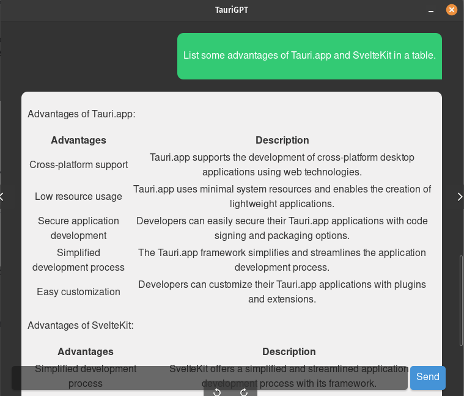

# TauriGPT

TauriGPT is a powerful, lightweight, and user-friendly chat application that leverages the Tauri framework, SvelteKit, and OpenAI's GPT-3.5-turbo API. Bring your own API key and experience the cutting-edge language model right from your desktop!




## Features

- Lightweight and responsive desktop application
- Built with the powerful Tauri framework and SvelteKit
- Supports OpenAI's GPT-3.5-turbo and GPT-4 API
- Easy to set up and use, just bring your own API key
- Cross-platform compatibility

## Prerequisites

Ensure you have the following installed on your system:

- Node.js (>= 14.x)
- Rust and its toolchain (>= 1.57.0)
- Tauri CLI (>= 1.0.0-beta)

## Getting Started

1. Clone the repository:

```bash
git clone https://github.com/FergusonB/TauriGPT.git
cd TauriGPT
```

2. Install the dependencies using pnpm

```bash
pnpm install
```

## Development

To start the development server, run:

```bash
pnpm tauri dev
```

This will open a new window with the TauriGPT application. Any changes made to the codebase will be reflected in the application in real-time.
Building

To build a binary for your platform, run:

```bash
pnpm tauri build
```

The binary will be available in the src-tauri/target folder, ready for distribution.

## Contributing

We appreciate any contributions to improve TauriGPT. To contribute, please follow these steps:

- Fork the project
- Create a new branch (git checkout -b feature/your-feature)
- Commit your changes (git commit -m 'Add your feature')
- Push to the branch (git push origin feature/your-feature)
- Open a Pull Request

## License

TauriGPT is licensed under the MIT License. See the LICENSE file for more details.
Support

If you have any questions or need assistance, please open an issue on GitHub or join our community chat.

